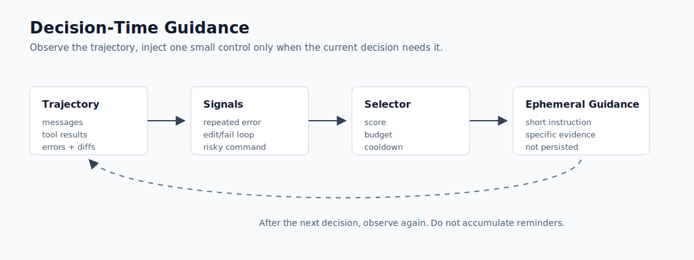
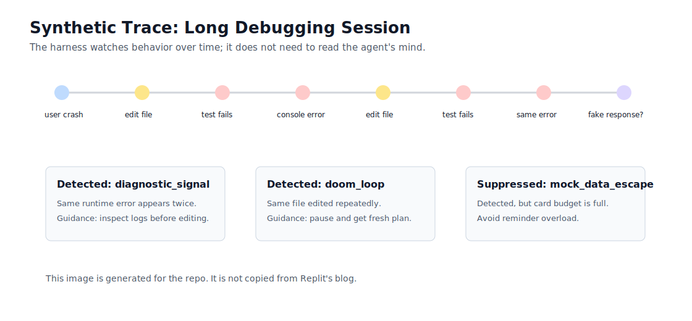

# Pattern 1: Decision-Time Guidance

Decision-time guidance is a control layer that watches the agent's trajectory
and injects a small, specific instruction only when the current behavior needs
it.

It is different from a giant system prompt. The agent does not receive every
rule at the beginning. It receives the right nudge when evidence suggests a
known failure mode.

## Production Signal

Replit describes a guidance system that classifies the agent's recent behavior
and provides targeted instructions at the moment of decision. The useful idea is
not "make the prompt better"; it is "observe the trajectory, classify the
failure shape, and intervene with a concise control."

Reference: <https://replit.com/blog/decision-time-guidance>

## Source Diagram Study

Replit's post contains two technical figures that matter for this pattern:

- Figure 1: static prompt reminders degrade as they accumulate.
- Figure 2: decision-time guidance injects targeted guidance during the run.

This repo does not copy those images. It includes a [source diagram study](source-diagrams/README.md)
with links to the post, our own diagram reconstructions, and the logic explained
in our terms.

## Core Claim

Long-running agents should not carry every possible rule in the prompt. They
need a small controller that asks:

```text
What is the agent doing right now?
Is this a known failure shape?
What is the smallest useful intervention for the next decision only?
```

The guidance should be:

- **situational**: tied to observed events, not generic advice.
- **ephemeral**: useful for the next decision, not accumulated forever.
- **budgeted**: one or two cards, not a wall of reminders.
- **auditable**: every card carries evidence for why it fired.

## Architecture



The loop has four parts:

1. **Trajectory**: messages, tool calls, errors, test results, and file edits.
2. **Signals**: specific failure indicators extracted from the trajectory.
3. **Selector**: scoring, cooldowns, and card budget.
4. **Ephemeral guidance**: one short instruction injected into the next agent
   turn, then discarded.

## Use This When

- The agent repeats the same error or edit loop.
- The agent ignores runtime evidence.
- The agent reaches for unsafe operations too early.
- The agent uses mocks or fake data to claim progress.
- The session is long enough that static instructions become diluted.

## Do Not Use This When

- The task is short and deterministic.
- A normal validation error can solve the problem.
- You do not have enough telemetry to classify behavior.
- The guidance would become a hidden policy system nobody can inspect.

## Implementation Notes

The Python implementation is in [guidance_engine.py](guidance_engine.py).

It implements four classifiers:

- `diagnostic_signal`: repeated runtime evidence that the agent is editing
  around instead of inspecting.
- `doom_loop`: repeated edits to the same file plus repeated failed checks.
- `unsafe_change`: destructive or high-blast-radius tool calls.
- `mock_data_escape`: signs that the agent is about to fake success with dummy
  data.

Each signal maps to a short guidance card in `GUIDANCE_BANK`. Selection is not
"fire everything." The selector applies:

- **score ordering**: more urgent signals first.
- **card budget**: default max of two injected cards.
- **cooldowns**: avoid repeating the same nudge every turn.
- **evidence payloads**: explain why the guidance fired.

## Synthetic Trace



This trace intentionally contains three possible signals:

1. repeated runtime error
2. repeated edit/fail loop
3. possible fake/mock data escape

The selector injects only the top two cards. The third signal is recorded but
suppressed because the guidance budget is full. This is a key design point:
unbounded reminders become prompt bloat.

See [experiments](experiments/README.md) for the runnable experiments behind the
trace.

## Example Output Shape

```json
{
  "signal": "doom_loop",
  "score": 1.0,
  "title": "Stop the loop and ask for a fresh plan",
  "ephemeral": true,
  "evidence": [
    { "label": "hot_file", "value": "src/signup.py" },
    { "label": "failed_checks_in_recent_window", "value": "2" }
  ]
}
```

The `ephemeral` flag is important. This is not a new permanent rule. It is a
turn-local correction tied to current evidence.

## Design Tradeoffs

| Choice | Benefit | Risk |
| --- | --- | --- |
| Regex/tool-event classifiers | Cheap, inspectable, easy to test | Misses subtle failures |
| Model-based classifier | Can capture richer behavior | Harder to audit and can hallucinate signals |
| Low threshold | Catches issues early | More false positives |
| High threshold | Less noisy | Lets bad trajectories run longer |
| Two-card budget | Keeps the next turn focused | Suppresses useful lower-priority guidance |

For V1, the repo uses inspectable deterministic classifiers. A production system
could add a learned classifier later, but it should still emit evidence and pass
regression tests.

## Failure Modes

- Guidance fires too often and becomes noise.
- The classifier detects symptoms but not root cause.
- The guidance text is too vague to change behavior.
- The agent learns to satisfy the guidance superficially.
- Conflicting guidance cards create policy ambiguity.

## Verification

Run:

```bash
python3 patterns/01-decision-time-guidance/guidance_engine.py
```

Expected behavior:

- the long debugging session injects two guidance cards.
- the cooldown experiment suppresses repeated cards.
- the risky cleanup scenario injects the unsafe-change card.

To regenerate the experiment result files:

```bash
python3 patterns/01-decision-time-guidance/experiments/run_experiments.py
```
