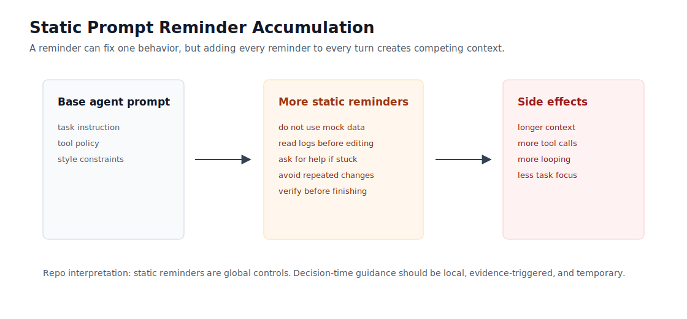
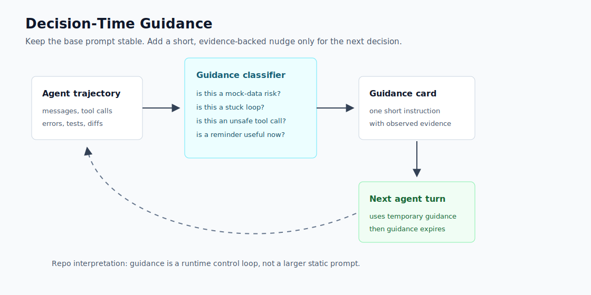

# Source Diagram Study: Replit Decision-Time Guidance

Source: <https://replit.com/blog/decision-time-guidance>

The Replit post contains two technical figures that shape this pattern. This
folder explains both in our own terms and points back to the source. The SVGs in
this repo are original reconstructions, not copied Replit assets.

## Copyright Boundary

The blog page is copyrighted by Replit. To keep this repo clean:

- We link to the original post instead of copying its images.
- We do not vendor Replit's PNG files.
- We recreate the concepts with original diagrams and our own explanation.
- We separate source-reported results from our local experiments.

## Figure 1: Static Prompt Reminders

Original location: see Figure 1 in Replit's post.

Repo reconstruction:



### What The Source Figure Is Showing

Replit tested the obvious fix for bad agent behavior: add a reminder to the
static prompt. This can work for a narrow failure, but the source figure shows a
bad scaling property. As more reminders are added globally, the agent has more
instructions competing for attention on every turn.

The blog reports that targeted reminders can improve the behavior they address,
but piling on reminders increases overhead and can worsen loops. In our terms:

```text
static prompt reminder = global tax on every decision
```

That tax is paid even when the reminder is irrelevant to the current step.

### Our Interpretation

Static reminders are blunt controls. They are useful for stable invariants:

- never expose secrets.
- respect tool permissions.
- use the requested language.

They are weak for situational behavior:

- "look at the logs now"
- "you are stuck in an edit loop"
- "this command has destructive blast radius"

Those are not permanent facts. They are current-state facts. They should be
injected only when the trajectory shows evidence.

## Figure 2: Decision-Time Guidance

Original location: see Figure 2 in Replit's post.

Repo reconstruction:



### What The Source Figure Is Showing

The second figure changes the control point. Instead of making the base prompt
larger, the system watches the agent during the run. A classifier decides whether
the current trajectory matches a known failure pattern. If it does, the harness
adds a short guidance card for the next decision.

In our terms:

```text
decision-time guidance = local correction for a local failure shape
```

This is closer to a runtime controller than a prompt-engineering trick.

### Our Interpretation

The useful architecture has four boundaries:

1. **Observation boundary**: collect events from messages, tool calls, tests,
   logs, diffs, and browser traces.
2. **Classification boundary**: convert raw events into named failure signals.
3. **Selection boundary**: decide whether to inject guidance, suppress it, or
   wait because of cooldown/card budget.
4. **Injection boundary**: add a short, evidence-backed instruction to the next
   turn only.

The key product-engineering idea is not that guidance text is magical. The key
idea is choosing the right moment to apply a small control.

## Mapping To This Repo

| Source concept | Repo implementation |
| --- | --- |
| Static reminders can be costly when accumulated | `card_budget` and `cooldown_turns` |
| Guidance should depend on trajectory | `classify_trajectory(events)` |
| Classifiers identify behavior-specific failures | `diagnostic_signal`, `doom_loop`, `unsafe_change`, `mock_data_escape` |
| Guidance is targeted | `GuidanceCard` with `instruction`, `reason`, and evidence |
| Results need measurement | `experiments/results/*.json` |

## What We Should Add Later

- A richer trace schema with browser, filesystem, and test-run events.
- A confusion matrix for each classifier.
- A comparison experiment: static prompt reminder versus decision-time guidance.
- A small UI that renders trajectories and injected guidance cards.

