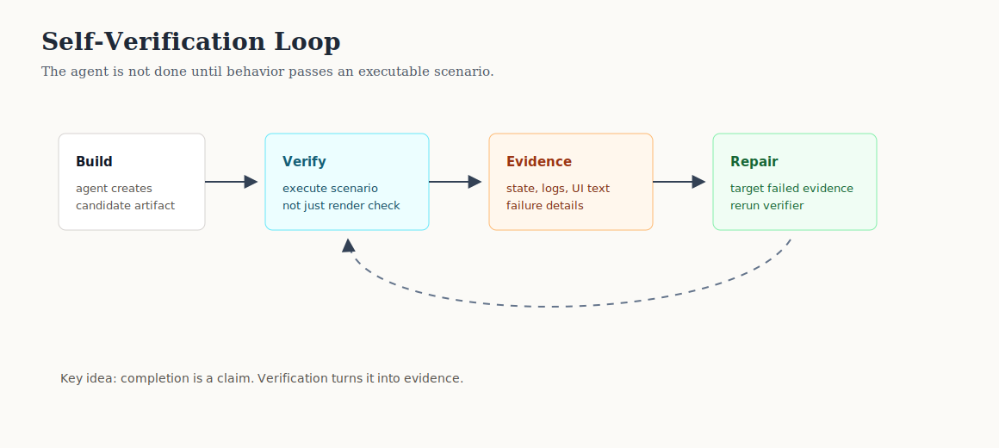

# Pattern 2: Self-Verification Loop

A self-verification loop forces an agent to prove that its output works before
claiming completion.

The agent is not done when it creates code, UI, or text that looks plausible. It
is done when an independent verifier executes the intended behavior, captures
evidence, and the result passes.

## Production Signal

Replit's automated self-testing work describes a coding agent that tests its own
apps by interacting with them and using runtime evidence to repair failures.
The production lesson is that an agent needs a behavioral evidence loop, not
just a completion message.

Reference: <https://replit.com/blog/automated-self-testing>

## Core Claim

Agent outputs need a second loop:

```text
build -> verify behavior -> inspect evidence -> repair -> verify again
```

The verifier should ask:

```text
Can a user perform the intended action?
Did state change in the right place?
Did the UI/API report the right result?
Did the check inspect behavior, not just structure?
```

## Architecture



## Use This When

- The agent creates user-facing behavior.
- The task can be exercised through a test, browser scenario, API call, or CLI.
- A shallow "the file exists" check would miss broken functionality.
- The agent can use failure evidence to repair its attempt.

## Do Not Use This When

- The artifact cannot be executed or inspected safely.
- The verifier only checks screenshots or static structure.
- The test can be easily gamed by hard-coded output.
- The verification environment differs too much from production.

## Implementation Notes

The Python implementation is in [verification_engine.py](verification_engine.py).

It models:

- `Application`: a tiny app with views, handlers, persistent state, and logs.
- `Scenario`: executable user intent.
- `VerificationStep`: user actions and assertions.
- `run_scenario`: executes a scenario and captures evidence.
- `repair_application`: applies a targeted repair based on failed evidence.

The example intentionally includes a "Potemkin" app: it renders a signup form
and success-looking message, but does not persist the submitted email. A shallow
verifier passes it. A behavioral verifier catches it.

## Verification Boundaries

| Boundary | Bad Check | Better Check |
| --- | --- | --- |
| UI exists | "form is visible" | submit form and inspect result |
| Button works | "button rendered" | click button and observe state transition |
| Save works | "success toast appears" | confirm durable state changed |
| Repair works | "agent says fixed" | rerun the same failing scenario |

## Failure Modes

- The verifier checks appearance instead of behavior.
- The agent hard-codes the expected test fixture.
- The verifier has no negative cases.
- The repair loop has no retry budget.
- Evidence is not persisted, so failures cannot be audited.

## Verification

Run:

```bash
python3 patterns/02-self-verification-loop/verification_engine.py
```

Expected behavior:

- shallow verification passes the broken app.
- behavioral verification rejects the broken app.
- repair uses failure evidence.
- behavioral verification passes after repair.

