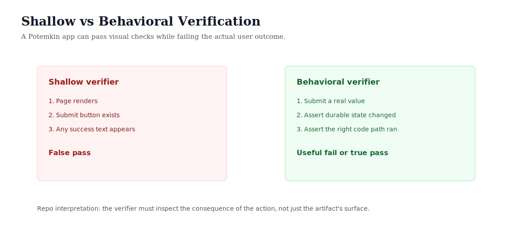

# Source Diagram Study: Replit Automated Self-Testing

Source: <https://replit.com/blog/automated-self-testing>

This folder explains the source idea in our own terms. The SVGs in this repo are
original reconstructions, not copied Replit assets.

## Idea 1: Build, Verify, Repair

Repo reconstruction:


The useful control loop is:

```text
candidate artifact -> executable scenario -> evidence -> repair -> rerun
```

The key is not that the agent says it tested the app. The key is that the system
captures evidence that another process can inspect.

## Idea 2: Shallow Versus Behavioral Checks

Repo reconstruction:



A shallow verifier can accidentally reward Potemkin work: an app displays a
success message but never changes durable state. Behavioral verification checks
the consequence of the user action.

## Mapping To This Repo

| Source concept | Repo implementation |
| --- | --- |
| Interact with the app | `run_scenario()` |
| Capture evidence | `Evidence` records |
| Detect fake success | state and log assertions |
| Repair from failure | `repair_application()` |
| Rerun after repair | `run_demo()` and experiments |

