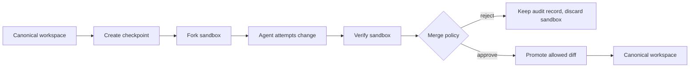

# Pattern 3: Reversible Sandbox Execution

Reversible sandbox execution lets an agent attempt risky work without granting
direct authority over durable state.

The agent does not edit the canonical workspace directly. The harness creates a
checkpoint, forks an isolated sandbox, lets the agent attempt a change, verifies
the result, and promotes only the allowed diff.

## Production Signal

Replit's snapshot engine work describes a practical version of this boundary:
agent work happens against checkpointed state, failed attempts can be inspected
or rolled back, and promotion is controlled.

Reference: <https://replit.com/blog/inside-replits-snapshot-engine>

## Core Claim

Autonomous agents need exploration room. Product systems need recovery,
auditability, and promotion gates.

The controller should ask:

```text
What state is the agent allowed to touch?
Can this attempt be rolled back completely?
Which changes are safe to promote?
What evidence proves the promoted state still satisfies invariants?
```

## Architecture



## Use This When

- The agent may edit files, data, dependencies, or infrastructure.
- A failed attempt should be inspectable but not destructive.
- Promotion must be auditable.
- Different attempts should be comparable before choosing one.
- A human or policy gate must approve high-risk changes.

## Do Not Use This When

- The task is read-only.
- The environment cannot be forked or restored cheaply enough.
- The sandbox still has unrestricted access to irreversible external APIs.
- The merge policy is vague.
- Rollback is treated as a substitute for verification.

## Implementation Notes

The Python implementation is in [sandbox_engine.py](sandbox_engine.py).

It models:

- `Workspace`: canonical state with files, database tables, dependencies, and
  external effects.
- `SnapshotStore`: immutable checkpoints used to fork sandboxes.
- `SandboxAttempt`: one isolated agent attempt.
- `verify_workspace`: invariant checks over sandbox state.
- `diff_workspaces`: audit-friendly change records.
- `merge_policy`: allow/reject decision before promotion.

The implementation is intentionally in-memory and standard-library only. It is
not pretending to be a container runtime. The goal is to make the control logic
inspectable.

## Merge Policy

The demo policy rejects:

- destructive database changes.
- dependency major-version changes.
- external side effects created inside the sandbox.
- missing required config values.
- changes that fail verification.

It allows:

- safe file edits.
- additive database changes.
- minor dependency upgrades when invariants still pass.

## Failure Modes

- The sandbox isolates files but not network side effects.
- The diff algorithm misses semantic changes.
- Verification passes but the merge policy promotes too broad a diff.
- The agent learns to satisfy only shallow invariants.
- Snapshots are retained without retention limits or privacy controls.

## Verification

Run:

```bash
python3 patterns/03-reversible-sandbox-execution/sandbox_engine.py
```

Expected behavior:

- a safe UI copy attempt is promoted.
- a destructive billing migration is rejected.
- an external side-effect attempt is rejected.

