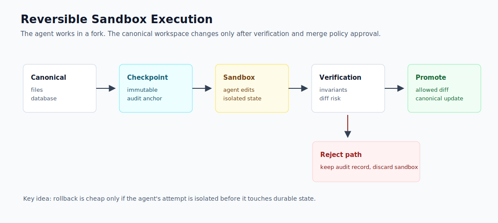
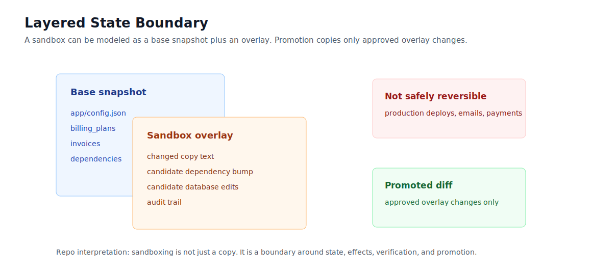

# Source Diagram Study: Replit Snapshot Engine

Source: <https://replit.com/blog/inside-replits-snapshot-engine>

This folder explains the source diagram ideas in our own terms. The SVGs in this
repo are original reconstructions, not copied Replit assets.

## Copyright Boundary

The blog page is copyrighted by Replit. This repo:

- links to the original post.
- does not vendor Replit images.
- explains the control logic in original language.
- uses original SVG diagrams.

## Idea 1: Snapshot Fork Promote

Repo reconstruction:



### What The Source Is Showing

The agent should not mutate canonical project state directly. It should work
against a snapshot-derived environment. After the attempt, the system decides
whether the result is safe to promote.

In our terms:

```text
checkpoint -> sandbox attempt -> verify -> promote or reject
```

The checkpoint is not merely a backup. It is an audit anchor: the system can
explain what changed and why it was promoted or rejected.

## Idea 2: Layered State Boundary

Repo reconstruction:



### What The Source Is Showing

A useful sandbox has layered state: a base snapshot plus the agent's candidate
changes. That layering makes comparison cheap and allows the platform to keep
failed attempts for inspection.

In our terms:

```text
sandbox = base snapshot + candidate overlay
promotion = copy only approved overlay changes
```

The hard boundary is external effects. A file or database snapshot cannot undo a
production email, a payment charge, or a deploy that already reached users.

## Mapping To This Repo

| Source concept | Repo implementation |
| --- | --- |
| Checkpoint before agent work | `SnapshotStore.create()` |
| Forked working environment | `SnapshotStore.fork()` |
| Candidate overlay | sandbox `Workspace` diffed against snapshot |
| Audit diff | `diff_workspaces()` |
| Promotion gate | `merge_policy()` |
| Rejection with evidence | `rejection_reasons` and failed `Check` records |

